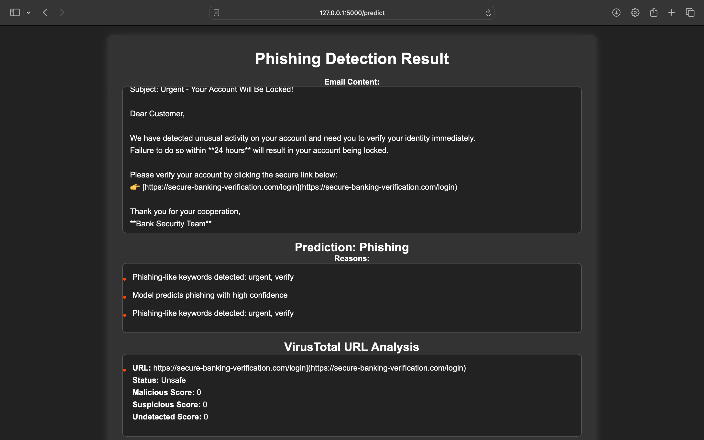
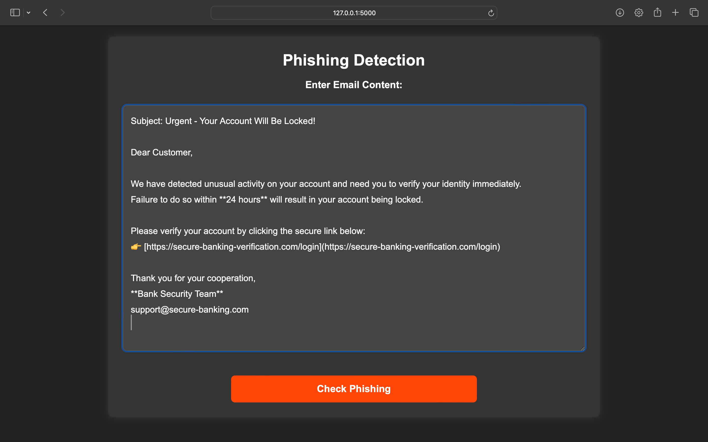
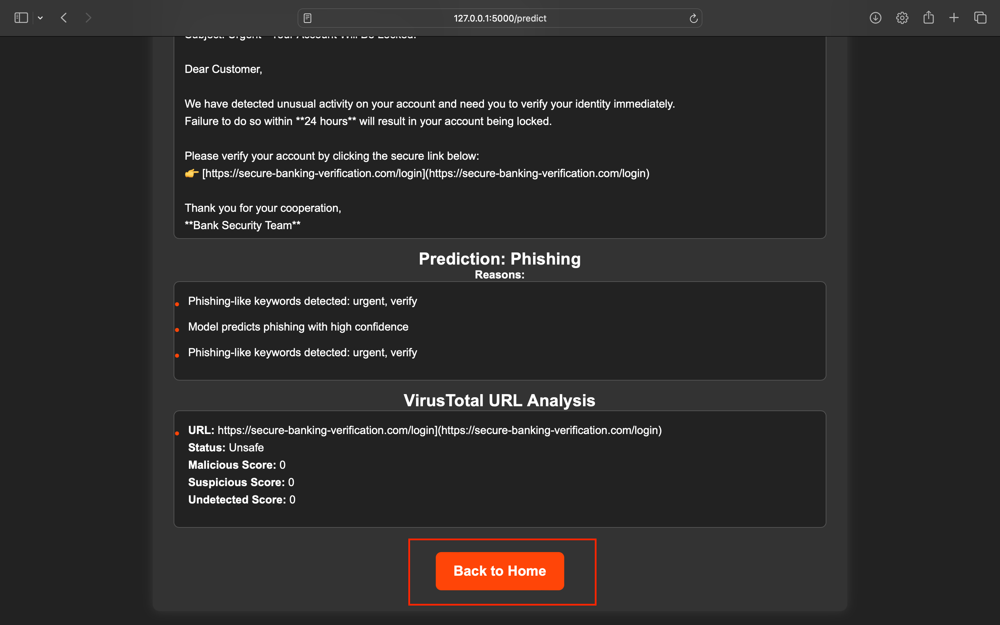

```markdown
# 📧 AI-Powered Phishing Detection System

  
*A machine learning system that analyzes email content to detect phishing attempts with explainable AI insights*

## ✨ Key Features
- **Real-Time Phishing Detection**: Instantly classifies emails as phishing or legitimate
- **AI Explanations**: Highlights suspicious words/phrases using SHAP values
- **URL Analysis**: Checks links against VirusTotal and Google Safe Browsing
- **Risk Visualization**: Interactive threat meter shows confidence level
- **Historical Dashboard**: Track detection trends over time

## 🛠️ Tech Stack
**Core**  
  
  


**Frontend**  
  
  


**ML Explainability**  


## 🚀 Quick Start

### Prerequisites
- Python 3.10+
- VirusTotal API key (free tier available)

### Installation
1. Clone the repository
```bash
git clone https://github.com/yourusername/phishing-detection.git
cd phishing-detection
```

2. Install dependencies
```bash
pip install -r requirements.txt
```

3. Set up environment variables  
Create `.env` file:
```ini
VIRUSTOTAL_API_KEY=your_api_key_here
GOOGLE_SAFE_BROWSING_API_KEY=your_api_key_here
```

4. Run the application
```bash
python app.py
```

Visit `http://localhost:5000` in your browser to start detecting phishing attempts!

## 🕵️ How It Works

### Detection Process
1. User submits email content through web interface
2. System checks for:
   - Suspicious keywords (SHAP explanation)
   - Malicious URLs (VirusTotal integration)
   - Social engineering patterns
3. ML model provides prediction with confidence score
4. Interactive results show detection reasons



## 📊 Features Deep Dive

### AI Explanation Engine
```python
def get_shap_explanation(text):
    vectorized = vectorizer.transform([text])
    shap_values = explainer.shap_values(vectorized)
    return sorted(zip(words, shap_values[0].flatten()), 
                key=lambda x: abs(x[1]), reverse=True)[:10]
```
*Identifies most influential words in prediction*

### Threat Intelligence Integration
- URL safety checks via VirusTotal
- Domain reputation analysis
- Redirect chain inspection

### Real-Time Dashboard
  
*Track historical detection patterns and system performance*

## 📚 API Documentation

**Endpoint**: `/predict`  
**Method**: POST

```json
{
  "email_content": "Urgent! Verify your account now: https://suspect-link.com"
}
```

**Response**:
```json
{
  "prediction": "Phishing",
  "probability": 0.92,
  "shap_explanations": {
    "verify": 2.34,
    "urgent": 1.89
  },
  "malicious_urls": ["https://suspect-link.com"]
}
```

## 🌟 Future Roadmap
- [ ] Browser extension integration
- [ ] Multi-language support
- [ ] Advanced header analysis (SPF/DKIM)
- [ ] Phishing attempt reporting system

## 🤝 Contributing
I welcome contributions! Please see our [Contribution Guidelines](CONTRIBUTING.md) for details.
