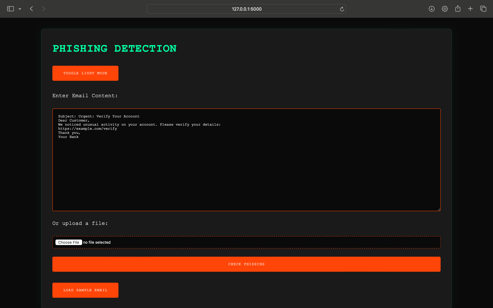
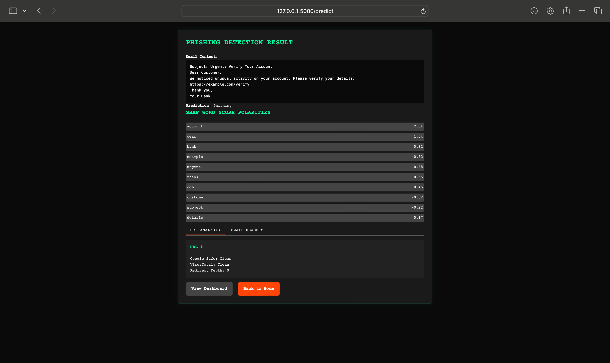
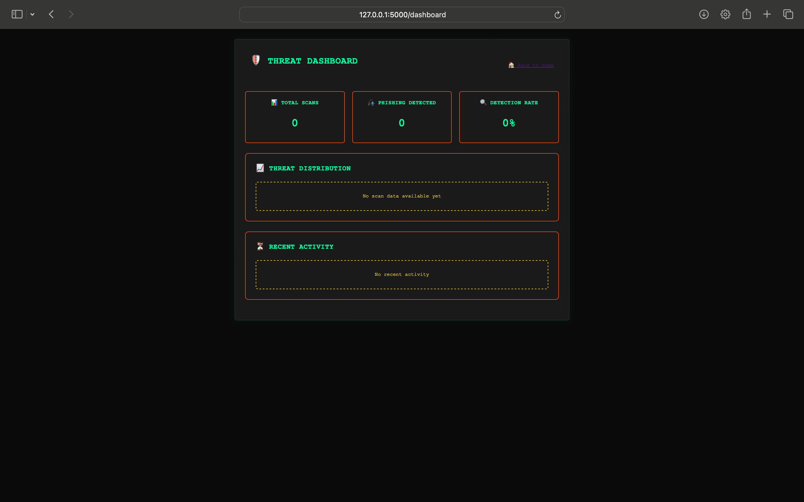

This folder contains the HTML templates for the AI-Powered Phishing Detection System. Below is an overview of each template and its purpose.

## File Structure and Purpose

### 1. `index.html`
**Purpose**: The main landing page for the phishing detection system.
- Allows users to enter email content or upload a file for analysis.
- Includes form validation and a dark/light mode toggle.
- Provides a sample phishing email for quick testing.

---

### 2. `result.html`
**Purpose**: Displays the results of the phishing detection analysis.
- Shows the original email content and classification as "Phishing" or "Legitimate."
- Includes a visual threat meter based on probability.
- Provides SHAP-based word score explanations.
- Displays URL and email header analysis results.

---

### 3. `dashboard.html`
**Purpose**: Displays historical phishing detection trends and insights.
- Logs previous phishing detection results for review.
- Includes interactive charts and visual analytics.
- Helps users track phishing threats over time.

## Execution Flow
1. **User accesses `index.html`** → Inputs email content or uploads a file.
2. **Form submission** → Sends data to the backend for phishing detection.
3. **User is redirected to `result.html`** → Displays classification results and analysis.
4. **User may navigate to `dashboard.html`** → View historical phishing trends.

## Notes
- Ensure `static/styles.css` is present for proper styling.
- Flask is required for the `url_for()` function to work correctly.
- Dark mode settings are stored in `localStorage` for user preference persistence.
- Flash messages dynamically display notifications for errors or updates.

For any issues, verify the Flask routes and backend logic align with these templates.

